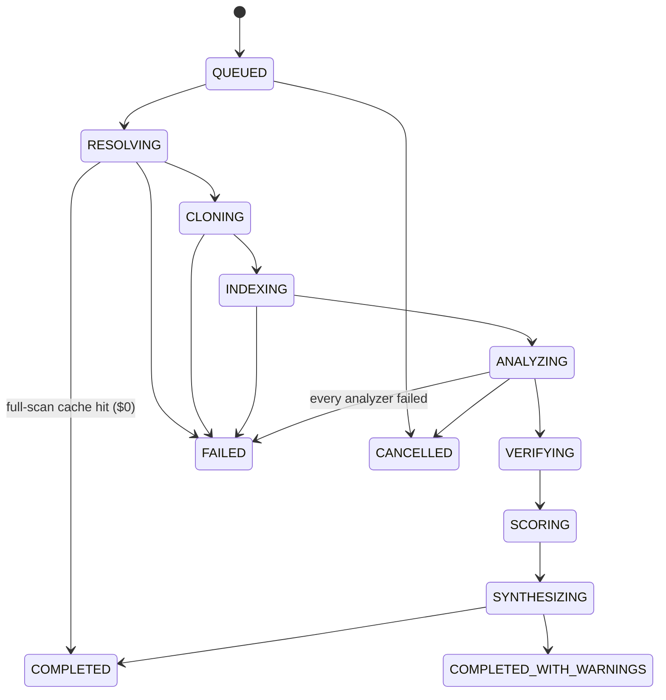

# Architecture

This document is the technical companion to the [README](../README.md). File references point at the code, which is the source of truth. The [design spec](superpowers/specs/2026-10-04-vibesec-ai-scan-review-design.md) records the original intent, and some of its numbers are stale.

## Workspaces

| Workspace | Stack | Role |
|---|---|---|
| `packages/shared` | Zod 4 | Single source of truth for API DTOs, `Finding`, events, fix plan and summary schemas. Used by both API and UI |
| `apps/api` | Node 24, Fastify 5, better-sqlite3 (WAL), `@anthropic-ai/sdk` | HTTP + SSE, job runner, scan pipeline, analyzers, LLM layer, audit |
| `apps/web` | React 19, Vite, Tailwind 4, shadcn/ui (Radix), TanStack Query, React Router 7, Shiki | Product UI |
| `sandbox/` | Docker | `sandbox-node`, `sandbox-python` (offline usage analyzers) and `sandbox-proxy` (egress allowlist). See [`sandbox/README.md`](../sandbox/README.md) |
| `fixtures/vuln-app` | Express/TS, Next.js-style, FastAPI | Deliberately vulnerable eval target + `expected.json` ground truth |

`apps/api/src/container.ts` is the composition root: the only place concrete implementations are wired together. It is overridable in tests and in the eval harness, for example to replace `fetch`, the sandbox, the GitHub client or the LLM transport.

## HTTP API

| Method & path | Purpose |
|---|---|
| `POST /api/scans` | Create a scan (`repoUrl`, `ref?`, `auth?` PAT, `options`). The `Idempotency-Key` header makes double-submits return the same scan |
| `GET /api/scans/:id` · `POST /api/scans/:id/cancel` | Scan state / cancel |
| `GET /api/scans/:id/events` | SSE. Events are persisted (`scan_events`) and replayed from `Last-Event-ID`, with a 15 s ping |
| `GET /api/scans/:id/summary` · `/findings` · `/findings/:findingId` · `/fix-plan` · `/index` · `/diagnostics` | Results |
| `PUT`/`DELETE /api/scans/:id/findings/:findingId/triage` | Triage decision (false_positive / accepted_risk / wont_fix, optional expiry) |
| `GET /api/scans/:id/export/sarif` · `/export/cyclonedx` | SARIF 2.1.0 / CycloneDX 1.6 SBOM+VEX (schema-validated before sending) |
| `GET /api/repos` · `/api/repos/:id/scans` | Repo history |
| `GET /api/audit` · `/api/audit/verify` | Audit timeline / hash-chain verification |
| `GET /api/health` | Health |

Errors are typed `AppError { code, kind: transient|permanent|budget|cancelled, retryable, userMessage }` and mapped to HTTP status codes. `userMessage` is actionable and never a stack trace.

## Scan pipeline

`apps/api/src/pipeline/scanPipeline.ts`. The orchestrator is a deterministic state machine. LLM work happens only inside bounded stages.

| Stage | What happens | On failure |
|---|---|---|
| **RESOLVING** | Calls GitHub repo metadata (visibility, size, default branch). This also re-checks access, so a private repo needs a per-scan token. It then resolves the commit SHA, computes cache keys and looks up the **full-scan cache** (`stages/fullCache.ts`) | Fatal |
| **CLONING** | `git clone --filter=blob:none --no-checkout` + checkout at the SHA, with hermetic git (see [security model](security-model.md)) and size and stall limits | Fatal |
| **INDEXING** | `index/RepoIndexer.ts`: file classification (source/test/generated/config…), JS/TS and Python import graphs, entrypoints (HTTP routes, serverless handlers, CLIs), frameworks | Fatal (nothing to analyze) |
| **ANALYZING** | All analyzers run concurrently (`Promise.allSettled`). On a rescan with a usable base, the analysis is **incremental** (`pipeline/incremental.ts`). Progress events are throttled to ≤ 4/s per analyzer | Each analyzer is degradable. If *all* fail, the scan fails (`ALL_ANALYZERS_FAILED`), because a silent empty result counts as an error |
| **VERIFYING** | Cross-analyzer dedupe (`findings/crossDedupe.ts`), then the Claude **skeptic** pass (`findings/skeptic.ts`) | Degradable |
| **SCORING** | Risk score + policy guards (`scoring/`), then the repo's triage suppressions are re-applied, then new/existing/fixed against the previous scan (`stages/scanStatus.ts`). Each step runs even if a previous one failed | Degradable |
| **SYNTHESIZING** | One Opus call over a findings digest (no code) produces the summary. A deterministic template is used if it is unavailable | Degradable (`SYNTHESIS_FALLBACK`) |

**Warnings vs notes.** `pipeline/warningLevels.ts` is the single table that classifies each warning code as `info`, an expected condition such as "no Docker" or "cache miss, ran in full", or `warning` (real degradation). Only `warning`s make a scan `COMPLETED_WITH_WARNINGS`, and only clean results are eligible as full-scan cache sources. Unknown codes default to `warning`.

### Analyzers (`apps/api/src/analyzers`)

| Id | Model / budget tier | Notes |
|---|---|---|
| `credentials` | Haiku false-positive filter (generic candidates only) | Rule-based detection over the tree + `git log -p` history (`historyDepth`, default 50). Tree findings win over history duplicates. Opt-in liveness checks (`verifySecrets`) |
| `credential-hunter` | Haiku, tier 1 | Config/CI/infra files + triage-flagged files, ~10k-token batches |
| `dependencies` | Sonnet reachability judge (≤ 30 packages) | Lockfiles: npm, pnpm, yarn v1/berry, poetry, uv, Pipfile, requirements. OSV advisories, reachability (sandbox usage analysis or import index), supply-chain signals, fix plan (registry-verified target versions) |
| `sast` | Sonnet deep pass (tier 1) + Haiku fast pass (tier 2) | Driven by the shared Haiku **triage** (relevance 0–3 per file, memoized per scan) |
| `taint` | Sonnet agent, tier 1 | One agent per entrypoint with an untrusted source, risk-ordered. 25 turns / 5 min wall clock per agent |
| `config` | Sonnet, tier 1 | GitHub Actions, Dockerfile, env exposure (`NEXT_PUBLIC_*` etc.), docker-compose, Terraform, k8s, Supabase/Firebase rules. Deterministic rules are hints |
| `quality` | Haiku, tier 3 | Fixed maintainability catalogue. Metrics are evidence only |

Every analyzer records **coverage** per file/entrypoint (`reviewed`, `reviewed-fast`, `cached`, `not-relevant`, `budget-skipped`, …) into `scan_coverage`. That is what the coverage report and the diagnostics page show.

## JobRunner (`apps/api/src/jobs/JobRunner.ts`)

- **Queue:** `MAX_CONCURRENT_SCANS` running, `QUEUE_CAPACITY` waiting (503 beyond). A scan is claimed when it is enqueued, so another process's recovery cannot adopt it.
- **Checkpoints:** completed stages are persisted. Every stage is idempotent, so **resume** skips checkpointed stages and re-runs the interrupted one. A resumed scan keeps whatever is left of its deadline, with at least 60 s.
- **Watchdog:** a heartbeat every `HEARTBEAT_MS`. Scans with stale heartbeats are adopted (resumed). Scans with no activity for `STUCK_AFTER_MS` are aborted as stuck. A scan that keeps dying is failed instead of resumed forever.
- **Private repos** can't be resumed after a restart, because tokens are never stored. They fail with a clear "start a new scan with your token" message.
- **Cancellation:** user cancel, shutdown and deadline all abort the same `AbortSignal`, which is threaded through git, HTTP, LLM, sandbox and rate-limiter waits. Graceful shutdown allows 20 s.
- **Cleanup:** the clone dir is removed and sandbox containers are swept in `onScanFinished`. Per-scan in-memory state (budget, triage memo, verifier state) is forgotten.

## Data model (SQLite, `apps/api/src/db/migrations`)

| Table | Contents |
|---|---|
| `repos`, `scans` | Repo identity / scan state, options (+ hash), cache keys, cost, warnings, checkpoint, reuse stats, idempotency key |
| `scan_events` | Persisted SSE events (replay) |
| `audit_log` | Append-only (UPDATE/DELETE triggers raise), SHA-256 hash chain |
| `scan_files`, `scan_imports`, `scan_entrypoints` | Repo index per scan |
| `findings`, `analyzer_results` | Findings (shared Zod `Finding` as JSON + indexed columns), per-analyzer outputs (used by incremental reuse) |
| `fix_plans`, `scan_summaries` | Dependency fix plan, synthesis output |
| `scan_coverage` | Per-file/entrypoint coverage status per analyzer |
| `llm_calls` | One row per LLM attempt: analyzer, purpose, model, prompt version, **input hash**, tokens (incl. cache read/write), cost, latency, stop reason, error code. No prompt text |
| `triage_cache`, `sast_cache`, `advisory_cache` | Per-file triage verdicts, per-file verified SAST issues, OSV responses (24 h TTL) |
| `suppressions` | Triage decisions per repo, matched by fingerprint (and merged fingerprints) across scans |

A `Finding` carries `baseSeverity` (set by the analyzer, never rewritten) and the scored `severity`/`riskScore`. It also carries `riskFactors[]` (the chips), `confidence`, `producedBy[]`, `fingerprint` + `mergedFingerprints`, `scanStatus` (new/existing/fixed), an optional `taintTrace[]`, and `secret` (redacted value, hash, liveness; never the raw value) or `dependency` (advisories, reachability, scope, paths) blocks.

## LLM layer (`apps/api/src/llm`)

| Concern | Implementation |
|---|---|
| **Tiers** | `fast` = Haiku 4.5, `deep` = Sonnet 5, `synthesis` = Opus 5 (env-overridable). Adaptive thinking/effort only on models that support it |
| **Structured output** | JSON-schema output format generated from Zod. The response is validated with Zod, and **one repair turn** includes the validation issues. Truncation (`max_tokens`) is detected, not retried blindly |
| **Refusal** | Retried once on a different tier (`FALLBACK_ROLE`) |
| **Overload** | After retries are exhausted, the call degrades one tier down (`DEGRADE_ROLE`). Degraded results carry lower confidence, and the skeptic may not *refute* on a degraded reply |
| **Budget** | `BudgetTracker` reserves each attempt's **worst case** (all `max_tokens` as output) before sending, then settles the actual cost. Per-scan limit = `options.budgetUsd` or `SCAN_BUDGET_USD`. Risk-first **lanes**: tier 1 (security) has first claim, tier 2 (SAST fast pass) may fill ≤ 70% and tier 3 (quality) ≤ 50%, counting tier-1 *projected* demand from work leases. Refusals become `budget-skipped` coverage |
| **Rate limiting** | Client-side token buckets on requests/min and input tokens/min, strict FIFO (large requests are not starved) and abortable. Concurrency semaphore (`LLM_CONCURRENCY`) |
| **Prompt caching** | Order is frozen system prompt (+ untrusted-content policy) → per-scan context pack → volatile per-call prompt, with `cache_control` breakpoints. No timestamps or ids in cached parts |
| **Agents** | `LlmClient.agent()`: tool loop with typed tools, a `finishTool` (e.g. `report_flow`), max turns, wall clock, budget and refusal stops. Tool output is truncated |
| **Accounting** | Every attempt goes to `llm_calls`. Live `cost` events go to the UI (≤ 1/s) |
| **Modes** | `mock` (recordings → deterministic per-analyzer responders → schema fakes), `live`, `record` (live + write recordings) |
| **Breaker** | Anthropic circuit breaker (5 transient failures → open 30 s) around the whole retry chain |

## Resilience

| Operation | Timeout | Retries |
|---|---|---|
| Whole scan | `SCAN_DEADLINE_MS` (30 min) | — |
| `git ls-remote` / short git ops | 20 s / 30 s | — |
| `git clone` / fetch | `CLONE_TIMEOUT_MS` 120 s, abort after `GIT_STALL_MS` 30 s without progress | 2 |
| GitHub REST | 10 s | 3 + breaker |
| OSV querybatch / detail | 15 s / 10 s | 3 + breaker |
| npm / PyPI registry | 10 s | 3 + breaker |
| Credential liveness check | 5 s (timeout ⇒ `unknown`, never "revoked") | 0 (a 401 *is* the answer) |
| Anthropic request (streamed) | `LLM_TIMEOUT_MS` 10 min | 4 + breaker |
| Taint agent per entrypoint | 5 min wall clock, 25 turns | — |
| Agent regex `grep` | 1.5 s matching budget (in a `vm` with timeout), 30 s I/O | — |
| Sandbox install / analyze | 180 s / 120 s (container killed) | 1 (daemon errors only) |
| SSE | 15 s ping | client reconnects with `Last-Event-ID` |

Backoff is exponential with full jitter (base 500 ms, cap 30 s). A server `retry-after` wins up to 60 s. Only `transient` errors retry. Circuit breakers wrap whole retry chains, so one exhausted chain counts as one failure.

**Fail-open policies** (security-preserving):
- A failed AI false-positive filter keeps the rule-based credential.
- A failed config review keeps the hint at low confidence (`ai_unreviewed`).
- A failed skeptic call leaves findings unchanged.
- An untriaged file defaults to relevance 2 (reviewed, not skipped).
- OSV down ⇒ supply-chain findings still reported with `DEPENDENCY_ADVISORIES_UNAVAILABLE`.
- Registry down ⇒ fix plan from advisory versions, marked unverified.

## Caching & cost

| Layer | Key | Notes |
|---|---|---|
| **Full-scan cache** | repo + commit + result configuration (options, analyzer versions, **prompt versions**, models, mode) | Serves only **clean** (no real warnings), **original** (not itself a copy) results younger than `FULL_CACHE_TTL_HOURS` (24 h), because OSV and liveness change without a commit. Access is re-checked first. Per-scan state (triage suppressions, new/existing/fixed, summary stats) is **recomputed**, not copied |
| **Incremental rescan** | latest completed scan of the same repo + configuration at another commit | `git diff --name-status base..head` → changed ∪ reverse importers (depth 2) ∪ entrypoints whose import closure reaches a change. Reused results are re-validated. Analyzers that failed in the base are never reused. Falls back to full when > 40% of files changed or the base commit is unavailable. Reports "N files reused, ~$X saved" |
| **Triage cache** | sha256(content) + prompt version + model | Unjudged (fail-safe) verdicts are never cached |
| **SAST cache** | sha256(per-file prompt incl. local context and hints) + prompt version + model of the pass | Stores only verified issues, as locations + prose. Snippets are re-read from the file. Degraded results are never cached |
| **OSV cache** | package / vuln id | 24 h. Registry metadata 1 h in memory |
| **Prompt caching** | Anthropic ephemeral cache | System prompt shared across scans, context pack across a scan's files |

## Risk scoring (`apps/api/src/scoring`)

1. **Signals** (`factors.ts`, pure): base severity, confidence, max CVSS, credential liveness / history-only / client-exposed, dependency reachability / scope / direct, file context (test/example/docs/vendored by path), entrypoint exposure (location or taint-source file is an entrypoint), AI verdict factors.
2. **Score** (`riskScore.ts`): *impact × likelihood/context*, modeled on OX Security's contextual prioritization and Snyk's Risk Score.
   - **Impact** is the base-severity anchor (critical 92 … info 8), or CVSS × 10 when that is higher.
   - **Multipliers** are applied in a fixed order:

     | Factor | Multiplier |
     |---|---|
     | Live credential | ×1.3 |
     | Revoked | ×0.35 |
     | History-only | ×0.75 |
     | Client-exposed | ×1.2 |
     | Reachable | ×1.15 |
     | Transitive, unknown reachability | ×0.85 |
     | Unreachable | ×0.45 |
     | Dev dependency | ×0.6 |
     | Public route / entrypoint | ×1.2 / ×1.1 |
     | Test/example/docs | ×0.4 |
     | Vendored/generated | ×0.7 |
     | Medium / low confidence | ×0.9 / ×0.7 |
     | AI-unreviewed | ×0.95 |

   - Each multiplier is converted into the point difference it caused, which becomes a UI **factor chip** ("Live credential +23").
   - Bands: ≥ 85 critical, ≥ 65 high, ≥ 40 medium, ≥ 15 low, else info.
3. **Policy guards** (`applyPolicyGuards`) are deliberately *outside* the weighting function, so no tuning can break them. Each guard that fires is recorded as a `policy:*` chip.
   - Scores are clamped to 0–100.
   - A known-malicious package is never below critical.
   - An AI-refuted finding is never above info, **unless** it is a credential verified live (provider ground truth beats AI opinion).
   - A live credential is never below high.
4. **Grade** (`synthesis/synthesisPrompt.ts` `gradeFor`):
   - F: any critical that is confirmed exploitable (reachable dependency, live credential, or high-confidence code finding).
   - D: any other critical, or an exploitable high.
   - C: any high.
   - B: any medium.
   - A: anything less.

   Opus writes the narrative, but the grade it returns can never be better than this rubric. Findings triaged `false_positive` and `fixed` rows are excluded. `accepted_risk`/`wont_fix` still count, because the risk exists.
